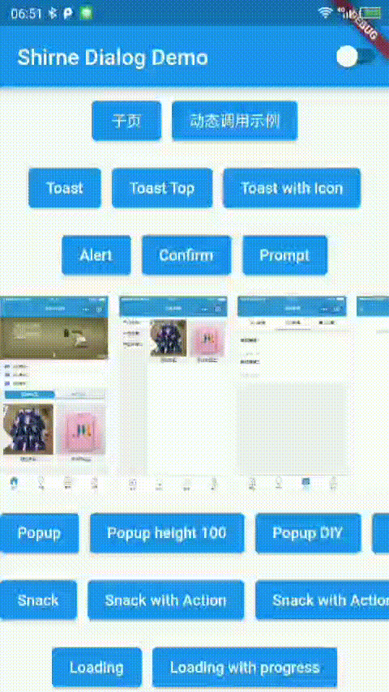
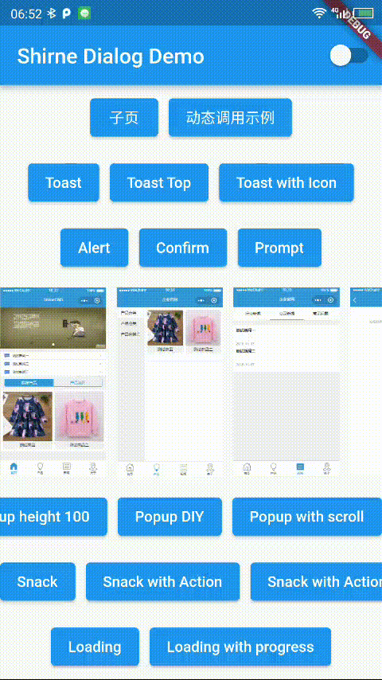
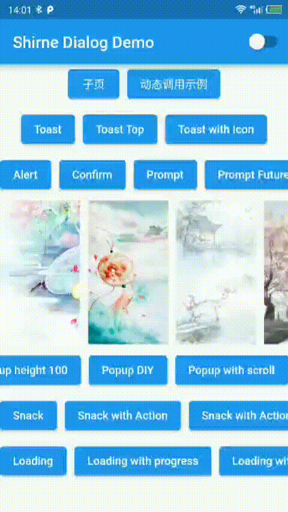

# Shirne Dialog

A flutter package to use alert, confirm, prompt, toast, popup, snack, imagePreview, loading etc. with customizable style in anywhere.

<a href="https://pub.dev/packages/shirne_dialog">
    
</a>

## Features

- ✅ toast
- ✅ alert
- ✅ confirm
- ✅ prompt [new]
- ✅ modal
- ✅ popup
- ✅ imagePreview
- ✅ snack
- ✅ loading


- 🚧 imagePreview support hero
- 🚧 modal adaptive & more style
- 🚧 popmenu
- 🚧 guide

## Notice

You must initialize ShirneDialogTheme on theme.extensions between flutter version 3.0.0 - 3.0.4

Above 3.0.5 dialog will use default theme when not provide in ThemeData.extends

## Preview

[Online Demo](https://shirne.github.io/dialog/)

|Toast|Dialog|ImagePreview|
|:-:|:-:|:-:|
||||
|Loading|Popup|Snackbar|
||||


## Usage


Recommanded usage
```

// Or use Mydialog.navigatorKey with MaterialApp
// and set theme for dialog
 MaterialApp(
    //...
    navigatorKey: MyDialog.navigatorKey,
    localizationsDelegates:[
        ShirneDialogLocalizations.delegate,

        // flutter locals see [https://docs.flutter.dev/development/accessibility-and-localization/internationalization]
        GlobalMaterialLocalizations.delegate,
        GlobalWidgetsLocalizations.delegate,
        GlobalCupertinoLocalizations.delegate,
    ],
    theme: ThemeData.light().copyWith(extensions: [const ShirneDialogTheme()]);
    //...
 );
 

// call in anywhere
MyDialog.confirm('aaa');
MyDialog.alert('test');
MyDialog.toase('test');
```

In [2.x](https://pub.dev/packages/shirne_dialog2) and earlier
```

MyDialog.of(context).toast('tip message');

MyDialog.of(context).alert(Text('alert message'));

MyDialog.of(context).confirm(Text('alert message')).then((v){

});

MyDialog.of(context).popup(Text('popup contents'));

MyDialog.of(context).snack('tip');


// initialize in MaterialApp
 MaterialApp(
    //...
    navigatorKey: MyDialog.navigatorKey,
    //...
);

// and then call in anywhere
MyDialog.confirm('aaa');
MyDialog.alert('test');
MyDialog.toase('test');
```
